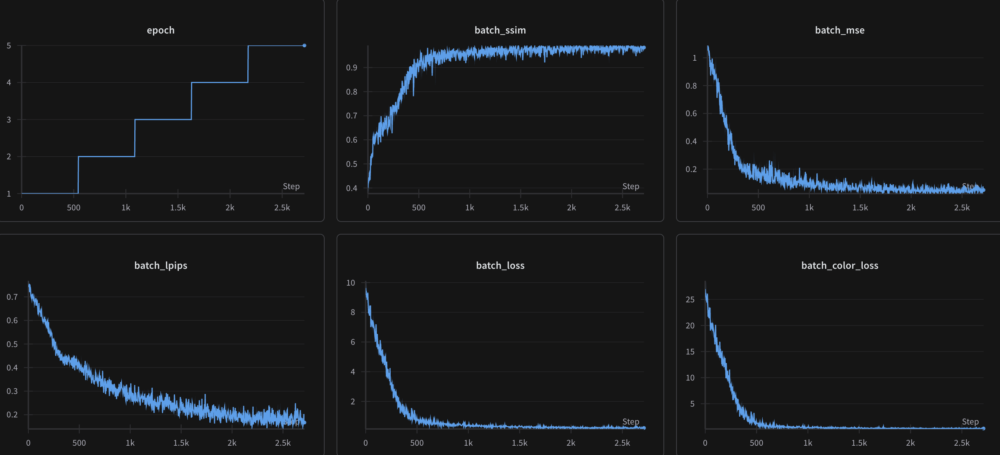

# W&B Run Visualizations

This repository contains visual summaries of 7 different model runs tracked using [Weights & Biases](https://wandb.ai/). Each image represents a W&B dashboard run that captures the training behavior and performance metrics of a particular model.

## Project Overview

The models were trained and monitored using W&B to track:

- Loss curves  
- Accuracy metrics  
- Parameter distributions  
- Training vs validation performance  
- System resource usage  

Each image below is a snapshot of one W&B run for a specific model.

---

## Model Visualizations

### Model 1

---

### Model 2

---

<!-- ### Model 3

--- -->

### Model 4

---

### Model 5

---

### Model 6

---

### Model 7

### Model 8

---